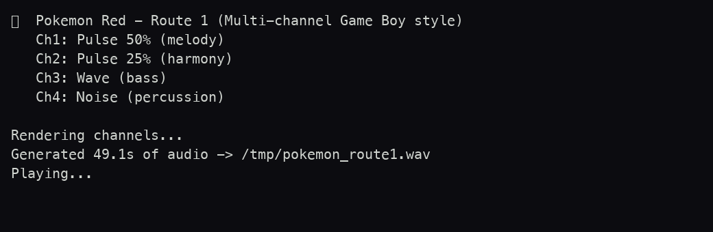

<div align="center">



# 🎵 Pokémon — Ruta 1 (Chiptune)

**El tema de la Ruta 1 de Pokémon Rojo/Azul, sintetizado desde cero con sonido de Game Boy.**


</div>

---

## Qué es esto

Más que un juego, es un **homenaje sonoro**: una transcripción nota a nota del icónico tema de la **Ruta 1** de Pokémon Rojo/Azul, **sintetizada en tiempo real** con el timbre del chip de sonido de la Game Boy. No usa ningún archivo de audio: cada onda se genera matemáticamente. Vienen **dos motores** distintos, uno minimalista en shell y otro multicanal en Python.

## 📖 La historia

La Ruta 1 es lo primero que escuchas al salir de Pueblo Paleta: esos primeros pasos por la hierba alta con una melodía alegre en Re mayor a ~127 BPM. Este proyecto recrea ese momento partiendo de la melodía escrita a mano en una notación propia (letras = notas, `-` = sostener, `.` = silencio) y la reconstruye con las cuatro voces clásicas del hardware.

## 🎮 Cómo se juega / escucha

No hay controles: lo ejecutas y suena. Elige el motor que prefieras.

**Versión shell** — síntesis de onda cuadrada de un canal con `sox`:

```bash
chmod +x pokemon_route1.sh
./pokemon_route1.sh
```

**Versión Python** — síntesis multicanal estilo Game Boy (recomendada):

```bash
pip install numpy
python3 pokemon_route1.py
```

> Necesitas **`sox`** (provee el comando `play`) para la versión shell, y **`numpy`** + un reproductor (`afplay` en macOS) para la versión Python.

## 📸 Captura

<div align="center">

</div>

## 🛠️ Bajo el capó

- **Versión shell (`pokemon_route1.sh`)**: Zsh + `sox`. Recorre la melodía carácter a carácter, agrupa duraciones y construye una cadena `synth ... square ...` que reproduce con `play`.
- **Versión Python (`pokemon_route1.py`)**: NumPy genera **4 canales** que emulan el APU de la Game Boy y los mezcla en un WAV de 16 bits a 44,1 kHz:
  - **Ch1 — Pulse 50 %**: melodía principal.
  - **Ch2 — Pulse 25 %**: armonía/contramelodía (onda más fina).
  - **Ch3 — Wave**: bajo con triangular cuantizada a 4 bits (como el canal *wave* real).
  - **Ch4 — Noise**: percusión con ruido y envolvente de decaimiento.
- **Frecuencias calculadas a mano** para cada nota y *fade* corto en cada nota para evitar clics.

## 📦 Créditos

Hecho por [@gavilanbe](https://github.com/gavilanbe) como pequeño homenaje sonoro dentro de su colección de juegos y experimentos de terminal. Composición original de la banda sonora de Pokémon; aquí solo se recrea con fines de aprendizaje y cariño retro.

## 📄 Licencia

[MIT](LICENSE)
